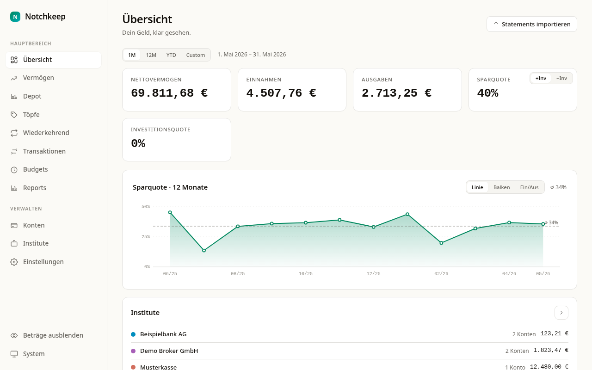

<div align="center">


# Notchkeep

**Simple Personal Networth.**

[](https://github.com/flo-zollner/notchkeep/releases/latest)
[](https://github.com/flo-zollner/notchkeep/actions/workflows/release.yml)
[](https://github.com/flo-zollner/notchkeep/releases)
[](COPYING)


A local-first personal finance and net-worth tracker for desktop and Android.
Your accounts, transactions, budgets, savings goals and securities — all in one
place, all on your own device.



</div>

## Table of Contents

- [Features](#features)
- [Download &amp; Install](#download--install)
  - [Desktop](#desktop)
  - [Android](#android)
  - [Updates](#updates)
- [Concept](#concept)
- [First Steps](#first-steps)
- [Privacy &amp; Sync](#privacy--sync)
- [Building from Source](#building-from-source)
  - [Prerequisites](#prerequisites)
  - [Development](#development)
  - [Release Build](#release-build)
- [License](#license)
- [Links](#links)

## Features

- 💶 **Accounts &amp; institutions** — checking, savings, brokerage, credit, cash and
  loan accounts, grouped under banks/brokers.
- 🧾 **Transactions** — manual entry or CSV/PDF import, automatic categorisation
  via rules.
- 📊 **Budgets** — monthly limits per category with live "left to spend".
- 🎯 **Buckets** — project-based savings goals, independent of categories.
- 📈 **Portfolio &amp; securities** — trades on brokerage accounts with FIFO cost
  basis and live prices from Yahoo Finance.
- 📥 **Statement import** — Trade Republic CSVs out of the box; more banks via the
  `Importer` trait.
- 🧭 **Guided onboarding** — first-run setup wizard and an interactive feature tour.
- 🔄 **Opt-in auto-updates** — the app can check for new versions and update
  itself from signed release artifacts (desktop and Android). Off by default,
  asked once, fully optional — no background calls until you enable it.
- 🔒 **Local-first &amp; private** — data stays in a local SQLite file; optional
  Syncthing sync, no cloud, no telemetry.
- 🖥️ **Cross-platform** — Linux, macOS, Windows and Android from one codebase
  (Tauri 2 + SvelteKit).

## Download &amp; Install

Pre-built bundles are attached to every
[release](https://github.com/flo-zollner/notchkeep/releases/latest).

### Desktop

| Platform | Bundle |
| -------- | ------ |
| Linux    | `.AppImage`, `.deb`, `.rpm` |
| Windows  | `.msi`, `x64-setup.exe` |
| macOS    | `.dmg` (Apple Silicon / aarch64) |

Download the bundle for your platform from the
[latest release](https://github.com/flo-zollner/notchkeep/releases/latest) and
run the installer. SHA-256 checksums are listed in the release notes.

### Android

A signed `Notchkeep_<version>.apk` is attached to every
[release](https://github.com/flo-zollner/notchkeep/releases/latest). Download it
to your device and install it — on first install Android asks you to allow
installing apps from this source (sideload). Once installed, the app can update
itself in-place (see [Updates](#updates)).

> Prefer to build it yourself? `pnpm tauri android build` — see
> [Building from Source](#building-from-source) for the toolchain.

### Updates

Auto-updates are **opt-in**. On startup the app asks once whether it may check
for new versions; nothing is sent to any server and no check happens until you
agree. You can change this anytime under *Settings → "Check for updates
automatically"* (plus a manual *"Check now"* button).

- **Desktop** (`.AppImage`, `.exe`, macOS `.app`): the app downloads and applies
  the signed update, then asks to restart.
- **Android**: the app downloads the signed `.apk`, verifies it, and launches
  the system installer.

Updates are delivered from GitHub Releases and every artifact is signed; the app
installs only verified packages. The in-app updater covers the `.AppImage`, the
Windows `.exe` and the macOS `.app`. Linux `.deb`/`.rpm` are **not**
auto-updated — there is no APT/DNF repository for Notchkeep, so update those by
downloading and reinstalling the latest package from the
[releases page](https://github.com/flo-zollner/notchkeep/releases/latest) (or
use the self-updating `.AppImage`).

## Concept

Data is stored locally in SQLite and optionally synced between devices via
Syncthing. Trade Republic CSVs are imported directly; additional banks can be
plugged in via the `Importer` trait.

**Account model:**

- **Institutions** (banks/brokers): containers with a name, icon, color, and
  optional BIC and country. An institution can hold 0–N accounts of different
  types (e.g. Trade Republic: one settlement account + one brokerage account).
- **Accounts** (`accounts`): checking (`bank`), savings (`savings`), brokerage
  (`broker`), credit (`credit`), cash (`cash`), loan (`loan`). Optionally
  assigned to an institution (`institution_id`); cash and loan accounts
  typically remain without an institution.
- **Sub-account hierarchy** via `parent_id` orthogonal to the institution, for
  virtual splits below an account.
- **Buckets** (`buckets`) for project-based savings goals, independent of
  categories.
- **Securities &amp; trades** on brokerage accounts (FIFO cost basis, live prices
  via Yahoo Finance).

All amounts are stored in cents (integer); conversion to decimals happens only
at the UI boundary.

## First Steps

On first launch Notchkeep opens a short **setup wizard**: pick your language and
theme, optionally create your first account, and get a quick import hint. An
optional **interactive tour** then points out the dashboard, navigation,
transactions, budgets and statement import.

From there you typically:

1. **Add an institution and account** (or let the wizard create the first one).
2. **Import statements** via *Import statements* — Trade Republic CSVs work out
   of the box.
3. **Set budgets** per category and **buckets** for savings goals.

You can re-run the wizard or the tour anytime from *Settings*.

## Privacy &amp; Sync

Your data never leaves your device unless you choose to sync it. There is no
cloud backend and no telemetry. Optional multi-device sync runs over
[Syncthing](https://syncthing.net) — you control where the SQLite database is
stored and which devices it syncs to.

## Building from Source

### Prerequisites

| Component    | Version                                                   |
| ------------ | --------------------------------------------------------- |
| Node.js      | ≥ 22 (LTS)                                                |
| pnpm         | ≥ 11 (`corepack enable pnpm`)                             |
| Rust         | current stable toolchain via [rustup](https://rustup.rs) |
| Tauri 2 deps | platform dependencies: https://tauri.app/start/prerequisites |

### Development

```bash
pnpm install
pnpm tauri dev
```

### Release Build

```bash
pnpm install --frozen-lockfile
pnpm gen:licenses                  # generates static/licenses.html
pnpm tauri build                   # bundles binaries under src-tauri/target/release/bundle/
```

`pnpm tauri build` produces platform-specific bundles (`.deb`, `.AppImage`,
`.dmg`, `.msi`, …). The generated `licenses.html` is part of the SvelteKit
build (`static/`) and is embedded in every bundle.

## License

Copyright © 2026 Florian Zollner

This program is free software: you can redistribute it and/or modify it under
the terms of the **GNU General Public License** as published by the Free
Software Foundation — either version 3 of the License, or (at your option) any
later version.

This program is distributed in the hope that it will be useful, but
**WITHOUT ANY WARRANTY**; without even the implied warranty of MERCHANTABILITY
or FITNESS FOR A PARTICULAR PURPOSE. See the GNU General Public License for more
details.

The full license text is in [`COPYING`](COPYING).

SPDX-License-Identifier: `GPL-3.0-or-later`

## Links

- 📦 [Releases &amp; downloads](https://github.com/flo-zollner/notchkeep/releases)
- 🐞 [Issue tracker](https://github.com/flo-zollner/notchkeep/issues)
- 📜 [Third-party licenses](THIRD_PARTY_LICENSES.md) — the complete notice report
  is built at release time into `static/licenses.html` and is accessible in the
  app under *Settings → About*.
- 🦀 [Tauri](https://tauri.app) · [SvelteKit](https://svelte.dev/docs/kit)
</content>
